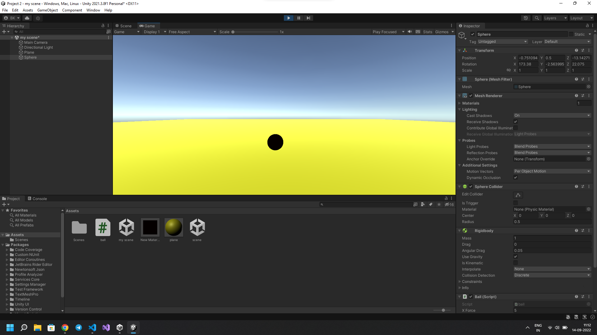
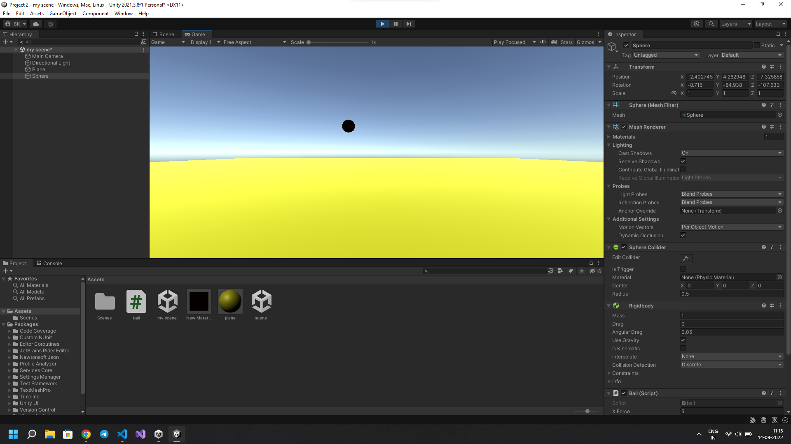

# RollaBall

## Aim:
To develop a 3D application for rolling a ball in unity.
## Algorithm:

1. File -> Scene -> Select the scene -> Save as-> New folder(Scenes)-> File name (MiniGame)

2. Heirarchy -> 3D Object-> Plane 
[ Right side-> Inspector-> Change the name of plane (Name: Ground)
Transform -> Reset
Edit -> FrameSelected ]

3. Scale the ground by giving the scaling value as x=4 y=1 z=4

4. Heirarchy -> 3D Object-> Sphere
[ Right side-> Inspector-> Change the name of plane (Name: Player)
Transform -> Reset
Edit -> FrameSelected 
Transform -> Position -> y=0.5]

5. Hierarchy -> DirectionalLight
[ Inspector -> Change the color to white (255,255,255)]

6. Create a folder in project and name as Materials
[Material folder -> Create -> Material (Name: Background)
Inspector ->Surface Inputs ->BaseMAp (Choose the color)
Metallic map-> 0
Smoothness -> 0.25
Drag the Background to the plane and release the mouse

Material folder -> Create -> Material (Name: Sphere)
Inspector ->Surface Inputs ->BaseMAp (Choose the color)
Metallic map-> 0
Smoothness -> 0.75
Drag the Sphere material to the ball and release the mouse

 7. Hierarchy -> Player-> Inspector ->Add component-> Rigidbody

8. Create a new script -> Create a folder in project (Name: Scripts)
Hierarchy -> Player -> Inspector-> AddComponent-> NewScripts-> PlayerController( Click create and Add)
Copy the PlayerController and drag to Script folder
Double click the PlayerController file and type the coding

## Program:
```
##PROGRAM DEVELOPED BY : K.BALAJI
## REGISTER NUMBER : 212221230011
```
```
using System.Collections;
using System.Collections.Generic;
using UnityEngine;

public class ball : MonoBehaviour
{
    public float XForce = 5.0f;
    public float ZForce = 5.0f;
    public float YForce = 200.0f;

    // Start is called before the first frame update
    void Start()
    {
        
    }

    // Update is called once per frame
    void Update()
    {
        float X = 0.0f;
        if(Input.GetKey(KeyCode.A))
        {
            X = X - XForce;
        }
        if(Input.GetKey(KeyCode.D))
        {
            X = X + XForce;
        }
        float Z = 0.0f;
        if(Input.GetKey(KeyCode.W))
        {
            Z = Z + ZForce;
        }
        if(Input.GetKey(KeyCode.S))
        {
            Z = Z - ZForce;
        }
        float Y = 0.0f;
        if(Input.GetKeyDown(KeyCode.Space))
        {
            Y=YForce;
        }
    GetComponent<Rigidbody>().AddForce(X, Y, Z);
    }
}
```
## Output:


## Result:
Thus a 3D application for rolling a ball in unity is done successfully.
